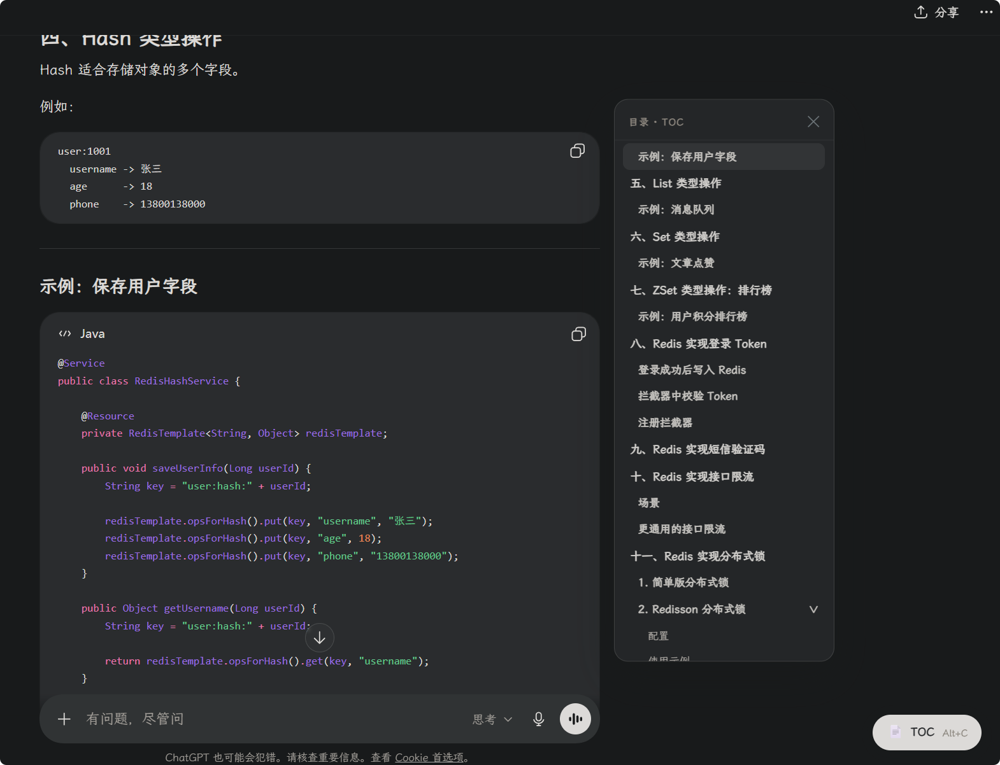

# ChatGPT Outline Navigator

为 ChatGPT 添加可折叠的侧边目录，方便在长对话中快速浏览和跳转消息。

## 效果图

## 功能

- 自动为 ChatGPT 对话生成侧边目录
- 支持折叠、展开和快速定位
- 使用 `Alt+C` 快捷键切换目录显示
- 适配 `chatgpt.com` 和 `chat.openai.com`

## 安装

1. 在浏览器中安装 Tampermonkey。
2. 新建用户脚本。
3. 将 [chatgpt-outline-navigator.user.js](./chatgpt-outline-navigator.user.js) 的内容粘贴进去并保存。
4. 打开或刷新 ChatGPT 页面即可使用。

## 兼容性

- Chrome
- Microsoft Edge
